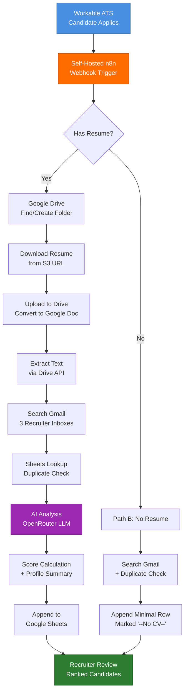

# AI Recruitment Screening & ATS Automation Platform

> **A production-grade recruitment automation platform that screens 60+ candidate applications daily, reducing per-candidate processing time from 10+ minutes to ~1 minute through AI-driven CV analysis, dynamic folder provisioning, and multi-system orchestration.**


---

## Overview

This case study documents a recruitment automation platform that replaces a heavily manual candidate intake and screening process with an end-to-end automated pipeline. Every time a candidate applies through the company's Applicant Tracking System (ATS), the pipeline:

1. Receives the application instantly via webhook
2. Files the resume into a job-specific Google Drive folder (creating one if missing)
3. Converts the resume into a machine-readable format
4. Sends the resume to a large language model for structured analysis
5. Scores the candidate against weighted business criteria
6. Cross-checks three recruiter inboxes for prior contact history
7. Detects duplicate applicants
8. Appends a fully enriched row to a recruitment tracking sheet

What previously took a recruiter 10+ minutes per candidate (downloading the resume, filing it correctly, reading it, summarising it, checking for duplicates, logging it) now happens in approximately 60 seconds with no human intervention. Recruiters open one sheet, see ranked and pre-screened candidates, and spend their time on interviews instead of data entry.

---

## Key Highlights

| Metric | Before | After |
|---|---|---|
| **Time per candidate** | 10+ minutes | ~1 minute |
| **Daily volume handled** | 10-15 candidates (capacity ceiling) | 60+ candidates |
| **Folder creation** | Manual, per job | Automatic, on first applicant |
| **Resume analysis** | Subjective, inconsistent | Structured AI scoring, repeatable |
| **Duplicate detection** | Often missed | Automatic email lookup |
| **Communication tracking** | Forgotten, scattered | Aggregated across 3 inboxes |
| **Audit trail** | Email threads only | Full execution log per candidate |

### What this unlocks for the business

- **3-4x throughput** on candidate processing without adding headcount
- **Faster time-to-shortlist** — recruiters see ranked candidates within minutes of application
- **Better candidate experience** — no candidates lost in inboxes or duplicate-contacted
- **Compliance-ready** — every action logged with timestamps
- **Self-hosted, no per-run fees** — unlimited scaling on fixed infrastructure cost

---

## Architecture



See [`diagrams/architecture.mmd`](diagrams/architecture.mmd) and [`diagrams/workflow-flowchart.mmd`](diagrams/workflow-flowchart.mmd) for full diagrams.

---

## Tech Stack

| Layer | Technology | Role |
|---|---|---|
| **Orchestration** | n8n (self-hosted) | Workflow engine, 25+ nodes, branching logic |
| **Hosting** | Hostinger VPS | Linux server, Docker container, persistent storage |
| **ATS** | Workable | Source of candidate events via webhooks |
| **AI Layer** | OpenRouter (GPT-class LLM) | Structured resume analysis, signal extraction |
| **Storage** | Google Drive | Resume archive, auto-organized by job role |
| **Document Processing** | Google Drive API | PDF-to-Doc conversion, plain text export |
| **Data Layer** | Google Sheets | Tracking sheet, duplicate lookups |
| **Communication** | Gmail (3 inboxes) | Recruiter contact history aggregation |
| **Authentication** | OAuth 2.0, Header Auth, Presigned S3 URLs | Multi-system credential handling |
| **Language** | JavaScript (ES2022) | Custom code nodes for normalization, scoring, helpers |

---

## How the Pipeline Works

### 1. Trigger (Webhook)
n8n's native Workable Trigger node auto-registers a webhook subscription with the ATS. Every new candidate fires the workflow within seconds.

### 2. Candidate Normalization
A JavaScript code node flattens the ATS payload into a consistent candidate object — name, email, phone, resume URL, job title, country, profile URL, source.

> 📄 See [`code/candidate-normalizer.js`](code/candidate-normalizer.js)

### 3. Resume Path vs. No-Resume Path
An IF node splits the flow. Candidates with resumes get the full AI treatment. Candidates without resumes still get logged with a placeholder.

### 4. Dynamic Folder Provisioning
The pipeline searches Google Drive for a folder matching the job title. If none exists (first applicant for a new role), one is created automatically. No recruiter ever creates folders manually.

> 📄 See [`code/folder-provisioning.js`](code/folder-provisioning.js)

### 5. Resume Handling
The presigned S3 resume URL is fetched, uploaded to the job folder, and copied as a Google Doc for downstream text extraction. The original PDF is retained for archive.

### 6. Multi-Inbox Communication Tracking
Three separate Gmail accounts (one per recruiter) are searched for any prior emails to the candidate's address. The aggregated count feeds into both the scoring penalty and the tracking sheet, so recruiters know if a candidate has already been chased.

### 7. AI Analysis
A structured prompt instructs the LLM to extract qualifications, experience, country, certifications, and red flags from the resume text. The response is strict JSON — parsed and validated.

> 📄 See [`code/ai-scoring-engine.js`](code/ai-scoring-engine.js)

### 8. Scoring
A pure-JavaScript scoring function applies weighted rules to the AI-extracted signals. Positive signals (preferred country, valid credentials) add points; negative signals (qualification mismatch, over-contact) subtract. Final score is clamped 0-100.

### 9. Duplicate Detection
A Sheets lookup checks if the candidate's email already exists in the tracking sheet. The result is added to the row as `Yes` or `No`.

> 📄 See [`code/duplicate-detector.js`](code/duplicate-detector.js)

### 10. Sheet Append
A fully enriched row is appended to the master tracking sheet: timestamp, hyperlinked name, AI profile summary, score, country, contact metadata, duplicate flag, source, and ATS record ID.

---

## Code Samples

This repository contains illustrative, sanitized versions of the four core code modules used in the pipeline:

| File | Purpose |
|---|---|
| [`code/candidate-normalizer.js`](code/candidate-normalizer.js) | Flatten the webhook payload into a clean candidate object |
| [`code/folder-provisioning.js`](code/folder-provisioning.js) | Find-or-create job folder logic |
| [`code/ai-scoring-engine.js`](code/ai-scoring-engine.js) | LLM call + structured scoring algorithm |
| [`code/duplicate-detector.js`](code/duplicate-detector.js) | Email-based duplicate lookup |

All proprietary scoring weights, prompt content, country lists, and client-specific rules have been replaced with generic placeholders.

---

## Documentation

| Document | Audience |
|---|---|
| [`docs/business-challenge.md`](docs/business-challenge.md) | What problem this solves and why it mattered |
| [`docs/solution-design.md`](docs/solution-design.md) | How the system was designed and the decisions behind it |
| [`docs/architecture.md`](docs/architecture.md) | Component-level technical architecture |
| [`docs/lessons-learned.md`](docs/lessons-learned.md) | What we'd do differently next time |

---

## Business Impact

### Quantitative

- **60+ applications/day** processed end-to-end with zero recruiter touch on intake
- **~93% reduction in processing time** per candidate (10 min → 1 min)
- **~600 minutes/day saved** — equivalent to 1.25 FTE freed from data entry
- **Zero per-execution cost** vs. SaaS automation alternatives that charge per task
- **100% audit coverage** — every candidate has a logged execution trail

### Qualitative

- Recruiters spend their time interviewing instead of filing
- New job postings get instant infrastructure (Drive folders auto-provision)
- Hiring managers get ranked shortlists faster
- Duplicate outreach is eliminated, improving candidate experience
- Compliance posture improved through full audit trail

---

## Future Improvements

These are intentionally not in v1 but represent the natural evolution of the platform:

- **Sheet-driven scoring weights** — let business users tune scoring rules without code changes
- **Real-time recruiter notifications** — Slack/email alerts when a high-scoring candidate lands
- **Multi-channel communication tracking** — extend beyond Gmail to LinkedIn, WhatsApp, calls
- **Self-service onboarding** — UI for recruiters to add new job rules without touching n8n
- **A/B testing of scoring models** — split traffic between two scoring functions to optimize over time
- **CV embeddings + similarity search** — match candidates to similar successful hires
- **Auto-rejection emails** for clear mismatches with respectful, personalized messaging
- **Interview scheduling integration** — auto-book intro calls for top-scored candidates
- **Reporting dashboard** — funnel metrics, source quality, time-to-hire

---

## Skills Demonstrated

For recruiters, engineering managers, and solutions architects evaluating this work:

- **Workflow Automation** — n8n at production scale across 25+ nodes
- **System Integration** — 6 external systems orchestrated via webhooks, OAuth, and API calls
- **AI Engineering** — LLM prompt design, structured output parsing, scoring algorithms
- **Backend Development** — JavaScript modules for normalization, scoring, error handling
- **Infrastructure** — Self-hosted deployment on VPS with persistent state and OAuth callbacks
- **API Design** — Webhook subscription management, authenticated HTTP calls
- **Business Translation** — Mapping recruitment domain rules into deterministic code
- **Documentation & Communication** — End-to-end documentation suitable for technical and business stakeholders

---

## Repository Structure

```
ai-recruitment-screening-automation-case-study/
├── README.md                          ← you are here
├── LICENSE
│
├── docs/
│   ├── architecture.md                Technical architecture deep dive
│   ├── business-challenge.md          Problem statement and context
│   ├── solution-design.md             Design decisions and reasoning
│   └── lessons-learned.md             Honest retrospective
│
├── diagrams/
│   ├── architecture.mmd               System architecture (Mermaid)
│   ├── workflow-flowchart.mmd         Step-by-step workflow (Mermaid)
│   └── architecture.png               Rendered architecture diagram
│
├── screenshots/                       Workflow + UI captures
│   ├── workflow-overview.png
│   ├── candidate-scoring.png
│   ├── folder-creation.png
│   ├── communication-tracking.png
│   └── ats-sheet-generation.png
│
├── code/                              Sanitized JavaScript modules
│   ├── candidate-normalizer.js
│   ├── ai-scoring-engine.js
│   ├── duplicate-detector.js
│   └── folder-provisioning.js
│
└── assets/
    └── project-banner.png             Repository banner image
```

---

## ⚠️ Disclaimer

This repository is a **public-facing case study**. It does **not** contain:

- ❌ The actual production n8n workflow JSON
- ❌ Real API credentials, tokens, or OAuth secrets
- ❌ Proprietary AI prompts or business-specific scoring weights
- ❌ Client data, candidate records, or identifiable information
- ❌ Real ATS subdomain, Google Drive folder IDs, or Sheet IDs
- ❌ Internal Hyper Flow business logic, country/region preference lists, or hiring criteria
- ❌ Hostnames, server addresses, or deployment configuration

All code samples, diagrams, and documentation in this repository are **illustrative reconstructions** intended to demonstrate the approach, architecture, and skills used — not to enable replication of the production system.

The original production workflow remains the intellectual property of Hyper Flow and its client. Anyone interested in implementing a similar system is welcome to use this case study as a reference; for a custom build, [reach out](#contact).

---

## License

[MIT License](LICENSE) — applies only to the illustrative code and documentation in this repository.

---

## Contact

Built and maintained by **Hyper Flow** — a Zoho-native CRM customisation and automation agency for SMBs.

For consulting inquiries on similar automation projects (recruitment, sales, operations, or any multi-system workflow):

- 🌐 Website: *available on request*
- 📧 Email: *available on request*
- 💼 LinkedIn: *available on request*

---

*This case study was prepared for portfolio purposes. Internal product names, client identifiers, and proprietary business logic have been removed.*
